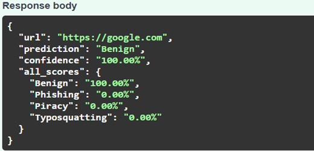
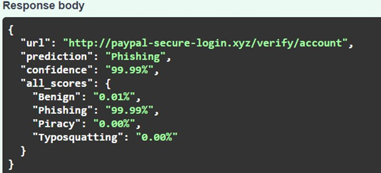
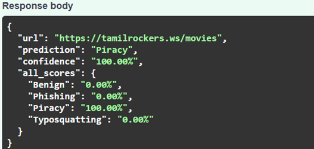
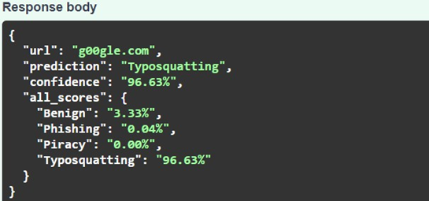

# 🛡️ Hybrid URL Threat Detection System using Deep Learning and ONNX

A Hybrid Deep Learning-based URL Threat Detection System that classifies URLs into **Benign**, **Phishing**, **Piracy**, and **Typosquatting** using handcrafted URL features, semantic embeddings, and a BiLSTM neural network. The trained model is exported to ONNX format and deployed using FastAPI for efficient inference.

---

## 📖 Overview

With the rapid growth of cyber threats, malicious URLs have become one of the primary attack vectors used for phishing, piracy, and typosquatting attacks. This project presents a Hybrid Deep Learning approach that combines handcrafted lexical URL features, semantic embeddings generated using MiniLM, and a BiLSTM model to accurately classify URLs into multiple threat categories.

The model is trained in **Google Colab**, converted into **ONNX** format for optimized inference, and deployed as a **FastAPI** application.

---

## ✨ Features

- Multi-class URL classification
- Detects Benign, Phishing, Piracy and Typosquatting URLs
- Hybrid Deep Learning Architecture
- MiniLM Semantic Embeddings
- Character-level URL Encoding
- URL Feature Engineering
- Brand Name Detection
- Suspicious TLD Detection
- Homoglyph Detection
- Levenshtein Distance Analysis
- ONNX Runtime for fast inference
- FastAPI REST API deployment

---

# 🏗️ System Architecture

```
Dataset
    │
    ▼
Data Cleaning & Validation
    │
    ▼
URL Preprocessing
    │
    ▼
Feature Engineering
    │
    ▼
MiniLM Semantic Embeddings
    │
    ▼
Hybrid BiLSTM Model
    │
    ▼
Model Evaluation
    │
    ▼
ONNX Conversion
    │
    ▼
FastAPI Deployment
    │
    ▼
Threat Prediction
```

---

# 📂 Project Structure

```
Hybrid-URL-Threat-Detection/
│
├── app/
│   ├── main.py
│   ├── utils.py
│   ├── tokenizer/
│   ├── model/
│   │   ├── hybrid_model.onnx
│   │   ├── hybrid_model.onnx.data
│   │   ├── feature_scaler.pkl
│   │   └── brand_names.json
│   ├── static/
│   └── templates/
│
├── training/
│   └── Hybrid_URL_Threat_Detection_Report.ipynb
│
├── screenshots/
│
├── requirements.txt
├── check_onnx.py
├── test.py
├── README.md
└── .gitignore
```

---

# 🛠️ Technologies Used

### Programming Language
- Python

### Machine Learning & Deep Learning
- PyTorch
- Scikit-learn
- ONNX
- ONNX Runtime

### Natural Language Processing (NLP)
- Sentence Transformers
- MiniLM (all-MiniLM-L6-v2)

### Backend Framework
- FastAPI

### Data Processing
- Pandas
- NumPy

### URL Analysis & Feature Engineering
- tldextract
- urllib.parse
- python-Levenshtein
- Regular Expressions (re)

### Development Tools
- Google Colab
- Visual Studio Code
- Git
- GitHub

---

# 🧠 Machine Learning Pipeline

The project follows these steps:

1. Dataset collection
2. Data cleaning and validation
3. URL preprocessing
4. Character tokenization
5. URL feature extraction
6. MiniLM semantic embedding generation
7. Hybrid BiLSTM model training
8. Model evaluation
9. ONNX model conversion
10. FastAPI deployment

---

# 🔍 Engineered Features

The model extracts several handcrafted URL features, including:

- URL Length
- Digit Count
- Special Character Count
- Dot Count
- Hyphen Count
- HTTPS Detection
- IP Address Detection
- Subdomain Count
- Path Depth
- Query Length
- Shannon Entropy
- Suspicious TLD Detection
- Homoglyph Detection
- Brand Name Detection
- Levenshtein Distance
- Character Statistics

---

# 🚀 Installation

## Clone the repository

```bash
git clone https://github.com/Hansika2024/hybrid-url-threat-detection.git
```

## Navigate to the project

```bash
cd hybrid-url-threat-detection
```

## Install dependencies

```bash
pip install -r requirements.txt
```

---

# ▶️ Running the Application

Start the FastAPI server:

```bash
uvicorn app.main:app --reload
```

Open your browser:

```
http://127.0.0.1:8000/docs
```

to access the interactive Swagger API documentation.

---

# 📊 Model Performance

The proposed Hybrid URL Threat Detection System was evaluated on a held-out test dataset consisting of four classes: **Benign**, **Phishing**, **Piracy**, and **Typosquatting**.

### Overall Performance

| Metric | Score |
|---------|------:|
| **Accuracy** | **98%** |
| **Macro Precision** | **98%** |
| **Macro Recall** | **97%** |
| **Macro F1-Score** | **98%** |

### Class-wise Performance

| Class | Precision | Recall | F1-Score |
|--------|----------:|-------:|---------:|
| Benign | 0.96 | 0.98 | 0.97 |
| Phishing | 0.97 | 0.97 | 0.97 |
| Piracy | 0.98 | 0.94 | 0.96 |
| Typosquatting | 1.00 | 1.00 | 1.00 |

---

## 📈 Comparative Analysis

The proposed Hybrid Deep Learning model was compared against other approaches.

| Model | Precision | Recall | F1-Score |
|-------|----------:|-------:|---------:|
| Transformer-Based Model | 81.92% | 81.37% | 81.64% |
| Deep Learning Model | 87.95% | 87.62% | 87.78% |
| **Proposed Hybrid System** | **96.42%** | **96.18%** | **96.30%** |

The results demonstrate that the proposed Hybrid System significantly outperforms the baseline Transformer-based and Deep Learning models, achieving superior precision, recall, and F1-score across all evaluated classes.

---

# 📸 Results

### ✅ Benign URL Prediction



---

### 🎣 Phishing URL Prediction



---

### 🏴 Piracy URL Prediction



---

### 🔠 Typosquatting URL Prediction



---

# 🚀 Future Enhancements

- Browser Extension
- Explainable AI (XAI)
- Cloud Deployment
- Batch URL Analysis
- Real-time Threat Intelligence Integration
- Interactive Dashboard

---
